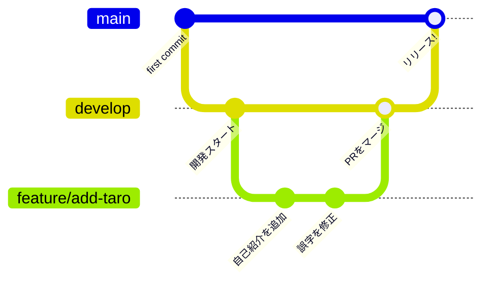

🌱 Git / GitHub 練習用リポジトリ

Git の「ブランチ」と GitHub での開発の流れ(Pull Request)を、実際に手を動かして体験するためのリポジトリです。

**壊れて困るものは入っていないので、安心して自由に操作してください!**

## 📚 まず読むもの

| ファイル | 内容 |
| --- | --- |
| [docs/hands-on.md](docs/hands-on.md) | 実際の作業手順(これに沿って進めます) |
| [docs/cheatsheet.md](docs/cheatsheet.md) | よく使う Git コマンド一覧 |
| [members/README.md](members/README.md) | 演習課題の説明 |

## 🌿 ブランチの考え方

ブランチは「作業スペースの分身」です。ブランチを分けることで、他の人の作業に影響を与えずに、自分の変更を安全に進められます。

このリポジトリでは、実際の開発現場でよく使われる構成をまねしています。

- **main** … 完成品(本番)のブランチ。直接変更しない
- **develop** … 開発中の最新版。作業ブランチはここから作る
- **feature/○○** … 1つの作業ごとに作る、使い捨ての作業ブランチ

## 🔁 作業の流れ(全体像)

| # | やること | コマンド / 操作 |
| --- | --- | --- |
| 1 | **clone** — リポジトリを自分のPCにコピー | `git clone` |
| 2 | **branch** — develop から作業ブランチを作る | `git switch -c feature/add-自分の名前` |
| 3 | **edit** — ファイルを編集する | `members/` に自分のファイルを追加 |
| 4 | **add & commit** — 変更を記録する | `git add` → `git commit` |
| 5 | **push** — GitHub にアップロードする | `git push` |
| 6 | **Pull Request** — 「develop に取り込んで」とお願いする | GitHub 上で操作 |
| 7 | **merge** — レビューOKなら取り込まれる | GitHub 上で操作 |

具体的なコマンドと解説は [docs/hands-on.md](docs/hands-on.md) へ!
